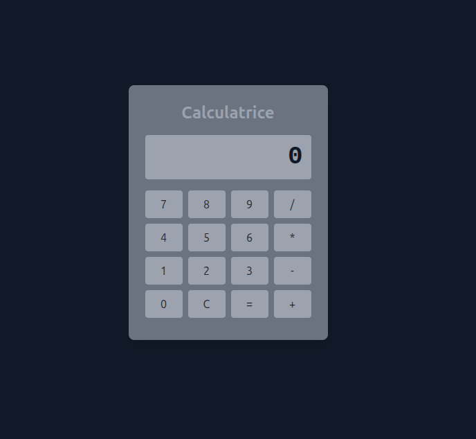

# 📱 Simple Calculator in JavaScript + TailwindCSS

## 📖 Description

A small personal project: creating a simple calculator using **HTML**, **CSS (via TailwindCSS)**, and **Vanilla JavaScript**.  
The goal was to learn how to:
- Manipulate the DOM
- Handle `click` events
- Build a responsive UI with Tailwind
- Dynamically process calculations using `eval()` (to be improved later for better security)

---

## ⚙️ Features

- ✅ Dynamic numeric display
- ✅ Numbers from 0 to 9
- ✅ Basic operations: `+`, `-`, `*`, `/`
- ✅ `=` button to display the result
- ✅ `C` button to reset the display
- ✅ Clean and responsive interface with **TailwindCSS**

---

## 📦 Technologies

- **HTML5**
- **TailwindCSS**
- **Vanilla JavaScript**

---

## 📌 To Do

- Replace `eval()` with a custom and secure parser
- Add keyboard shortcuts support
- Handle decimal numbers (`.`)
- Add calculation history

---

## 📄 License

Open-source project for personal learning purposes.

